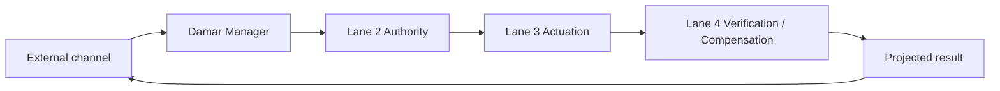
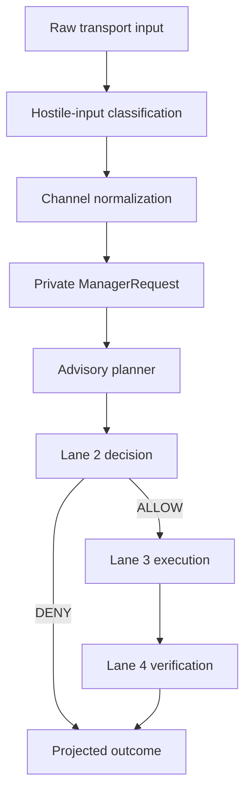
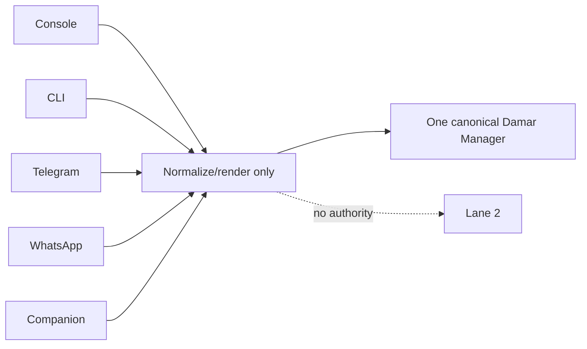
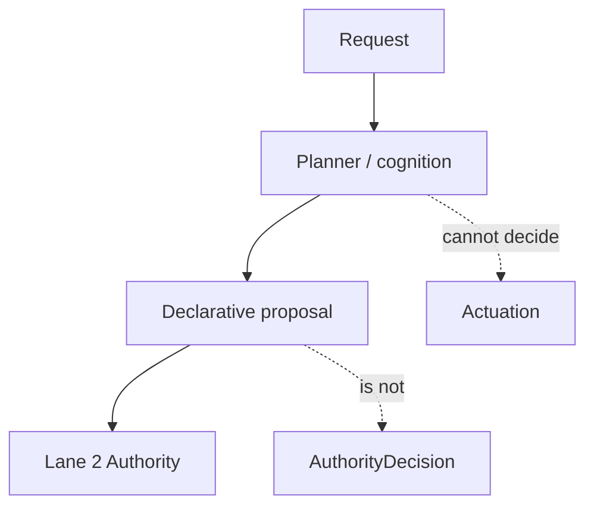
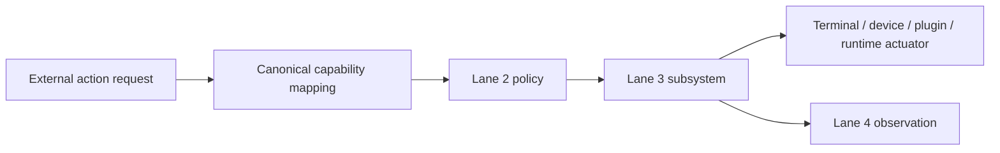
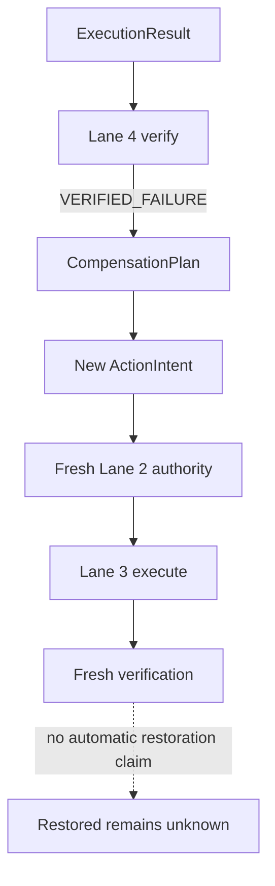
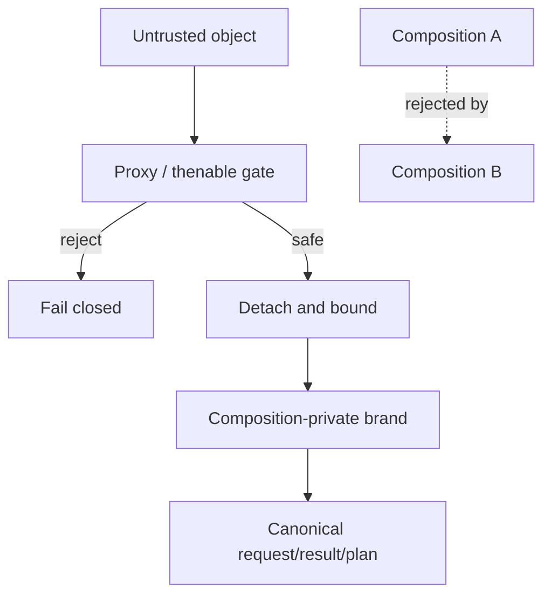
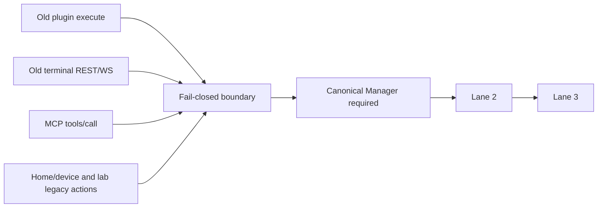

# Damar Lane 5 — Manager Routing V1

## Scope

Lane 5 is the external orchestration boundary. It normalizes transport input,
forms a per-composition Manager request, and coordinates the certified Lane 2,
Lane 3, and Lane 4 facades. Manager is not an authority, actuator, verifier,
or compensation authority.

## Request lifecycle

## Channel boundary

Adapters never authorize, execute, verify, compensate, or mint branded
objects. External AI requests are forced to `tools: []` at the shared
AI-runtime boundary. A model-generated tool call is therefore advisory only;
an action-capable request must be normalized into a Manager request and pass
Lane 2 before any Lane 3 execution.

The final AI execution sink independently checks for the canonical in-process
internal execution grant. Advertised tools, role, channel, or a caller-shaped
`exec` object never authorize provider-returned tool calls. Unknown or absent
channel context is fail-closed for tool execution.

## Planner boundary

`PLAN != AUTHORITY`; memory, model claims, and channel identity are evidence,
not authority.

## Capability routing

The recovered Manager accepts only canonical declarative action material. The
production Lane 2 authentication adapter remains fail-closed, so legacy
implementation-shaped action routes are blocked until a trusted capability
adapter and authentication policy are introduced.

## Verification and compensation

An original allow decision and a verification result are never bearer
authority. Compensation is always a newly authorized action.

## Hostile input and composition isolation

Each Manager composition owns its request/result brands. Proxy and own-then
inputs are rejected before unsafe reflection or Promise assimilation.

## Legacy bypass closure

No external legacy route receives a raw ToolRegistry, terminal, MCP, runtime,
plugin, or device executor.

## Route disposition

| Route family | Old behavior | Class | Final disposition | Manager | Lane 2 | Lane 3 | Lane 4 |
|---|---|---:|---|---:|---:|---:|---:|
| Console AI chat/stream, Telegram, WhatsApp, Companion | AI runtime entrypoints | A | Cognition-only: shared runtime strips all external tools | No | No | No | No |
| OpenAI `/v1/chat/completions` | External model chat | A | Authenticated, role-clamped, `tools: []`, channel fixed to `api` | No | No | No | No |
| Console Context Brief | External context summarization | A | Cognition-only via `aiRuntime.cognition()`; fixed external channel and no tools | No | No | No | No |
| Console Vision Analyze | External image/prompt analysis | A | Cognition-only via `aiRuntime.cognition()`; action proposals are not executed | No | No | No | No |
| Internal AI/agent/autonomy channels | Trusted internal cognition/action plumbing | A | Retained; must carry canonical internal provenance | As designed | As designed | As designed | As designed |
| Legacy `POST /api/v1/chat` | Agent plan executor could invoke plugins directly | C | Fail-closed before `chatService`/`PlanExecutor` | Required | Required | Required | Where applicable |
| Status, health, list, discovery, memory retrieval | Read-only inspection | A | Retained | No | No | No | No |
| Console plugin execute | Direct `ToolRegistry.execute` | C | Fail-closed before lookup | Required | Required | Required | Where applicable |
| Console terminal REST | Direct PTY mutation/command | C | Fail-closed | Required | Required | Required | Not implied |
| Terminal WebSocket | Direct PTY input/signal/resize | C | Fail-closed before attach | Required | Required | Required | Not implied |
| Runtime restart | Direct terminal command | C | Fail-closed | Required | Required | Required | Where observable |
| MCP `tools/call` | Direct registry execution | C | Fail-closed; discovery remains | Required | Required | Required | Where applicable |
| Home/device control and MQTT publish | Direct device/MQTT control | B | Fail-closed pending trusted capability adapter | Required | Required | Required | Where observable |
| Lab run/apply/phase and orchestration | Direct orchestration/execution | B | Fail-closed pending adapter | Required | Required | Required | Where observable |
| Automation trigger/config mutation | Direct automation service | B | Fail-closed pending adapter | Required | Required | Required | Where observable |
| Plugin forge/lifecycle mutation | Direct forge service | B | Fail-closed pending adapter | Required | Required | Required | Where observable |
| Memory/config/channel/companion mutation | Direct persistence/control-plane mutation | B | Fail-closed at external console/device ingress | Required | Required | Where applicable | Where observable |
| Internal ToolBus / Lane 3 implementation | Trusted internal execution plumbing | A | Retained; not an external ingress | Via authorized path | Yes | Yes | As designed |

Safety stop is a fail-safe exception: it disables execution and may be
invoked by the existing safety control. Safety release is not an exception;
the external Console route and direct controller call require canonical
Manager control and otherwise return `503`. This Lane 5 build has no external
release capability because production Lane 2 authentication remains
fail-closed.

The fail-closed dispositions are intentional security boundaries, not
authority grants. A future lane may add narrow capability adapters without
exposing Manager composition or weakening Lane 2 authentication. Duplicate
suppression remains process/composition-local and is not durable distributed
idempotency. `aiRuntime.cognition()` is the shared external cognition boundary;
direct `ensure().chat()` is reserved for trusted internal implementation paths
and is not an external integration API.

## Production surface

Production consumers use `createDamarManager()` from `src/manager/index.js`.
`createDamarManagerComposition()` remains an internal composition seam for
trusted bootstrap/test wiring and is not a public authority-extension API.

## Intentional limitations

The current production authentication adapter is fail-closed. Consequently,
unsupported legacy action families are unavailable rather than silently
executed. This preserves `NO EXTERNAL AUTHORITY BYPASS` until trusted identity,
capability mappings, and Lane 3 actuators are added for each family.
### Final AI tool execution boundary

Provider `toolCalls` are untrusted model output. `tools: []`, role, channel,
or a caller-shaped execution flag are not authority. The final
`RuntimeExecutor` sink requires both a canonical in-process execution grant
and an immutable exact tool scope captured when that grant is minted.
`CANONICAL GRANT != UNIVERSAL TOOL AUTHORITY`: an empty scope executes nothing,
an out-of-scope or mixed batch is rejected as a whole, and copied/serialized
grants are foreign. External cognition has no canonical grant; legitimate
trusted internal compatibility paths receive only explicitly scoped grants.
Grant domains are created per trusted runtime composition. The public
`Authorization` surface contains no grant minter; importing the domain helper
only creates an isolated foreign domain whose grants are not accepted by the
canonical executor. Scope metadata is held in a private WeakMap, so visible
copies and inherited objects cannot widen execution authority.

The AI registry has stable runtime identity and private atomic snapshots. Its mutation owner is captured by trusted bootstrap wiring and retained only by the runtime service; the public runtime facade has no canonical registry mutator. Ordinary runtime consumers can inspect metadata but cannot publish executable records. Every published record has a non-empty own data name and callable own data execute field; the complete candidate is validated before an atomic swap, with a detached frozen record copy.
Refreshes replace the snapshot through trusted runtime ownership; they do not
rebind the executor. Raw registry objects and executable handlers are not
returned by runtime/engine inspection APIs. `TYPE != PROVENANCE` and
`REGISTRY SHAPE != AUTHORITY` remain enforced.
